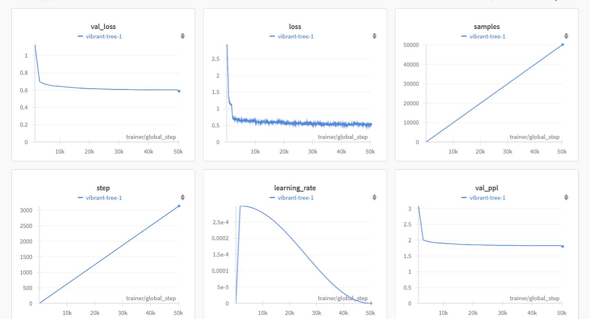

## VR-CARES (Virtual Reality Conversational Agents for Real-time Emotional Support)

Repository for <b>Open Your Heart: Evaluating the Impact of Conversation Strategies and Multi-Agent Setting of LLM Assistants on User Emotional Support Experience in Virtual Reality</b>, including the code of training strategies predictor and finetuning Llama Instruct for emotional support conversation.

## Finetune Llama3 on ExTES 
### Install LitGPT

Install LitGPT with all dependencies (including CLI, quantization, tokenizers for all models, etc.):

```bash
cd litgpt/litgpt
pip install 'litgpt[all]'
```

### Download Llama3 Instruct

go to [src/filedownload.py](src/filedownload.py), repalce the "**" with your token in line 4. And if you are in China or North Korea, enable line 2 to utilize mirror website of huggingface. Then run
```bash
cd ..
python src/filedownload.py
```

### Finetune with LoRA
```bash
cd litgpt/litgpt
python finetune/lora.py \
  --checkpoint_dir checkpoints/meta-llama/Meta-Llama-3-8B-Instruct \
  --device 1 \
  --precision 'bf16-true' \
  --train.global_batch_size 16 \
  --train.max_seq_length 512 \ # modify this to maximum your CUDA memory
  --data JSON \
  --data.prompt_style 'llama3' \
  --data.json_path /litllama/ExTES/ExTES.json \
  --data.val_split_fraction 0.1 \
  --data.mask_prompt True \
  --out_dir out/finetune/llama3-instruct-esconv \
```

### Hyper parameters (for reference):

<details>
<summary>Click to unfold</summary>

```bash
checkpoint_dir: checkpoints/meta-llama/Meta-Llama-3-8B-Instruct
out_dir: out/finetune/llama3-instruct-esconv
precision: bf16-true
devices: 1
lora_r: 8
lora_alpha: 16
lora_dropout: 0.05
lora_query: true
lora_key: false
lora_value: true
lora_projection: false
lora_mlp: false
lora_head: false
data:
  class_path: litgpt.data.JSON
  init_args:
    json_path: ExTES/ExTES.json
    mask_prompt: true
    val_split_fraction: 0.1
    prompt_style: llama3
    ignore_index: -100
    seed: 42
    num_workers: 4
train:
  save_interval: 1000
  log_interval: 1
  global_batch_size: 16
  micro_batch_size: 1
  lr_warmup_steps: 100
  epochs: 5
  max_seq_length: 512
  learning_rate: 0.0003
  weight_decay: 0.02
  beta1: 0.9
  beta2: 0.95
  min_lr: 6.0e-05
eval:
  interval: 100
  max_new_tokens: 100
  max_iters: 100
logger_name: wandb
seed: 1337
```
</details>

### Wandb :



### Merge .pth.lora with initial weight to .pth
```bash
litgpt convert from_litgpt \
   --checkpoint_dir out/finetune/llama3-instruct-esconv/final/ \
   --output_dir out/convert/hf-llama3-instruct-esconv \

```

### Chat with finetuned model with strategies predictor
```bash
cd src
python chatLlama3ES.py
```

Cite our work:
```